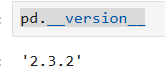
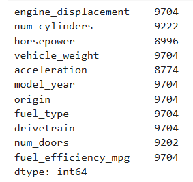
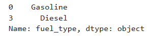
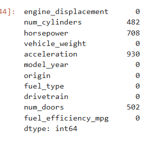
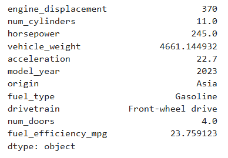
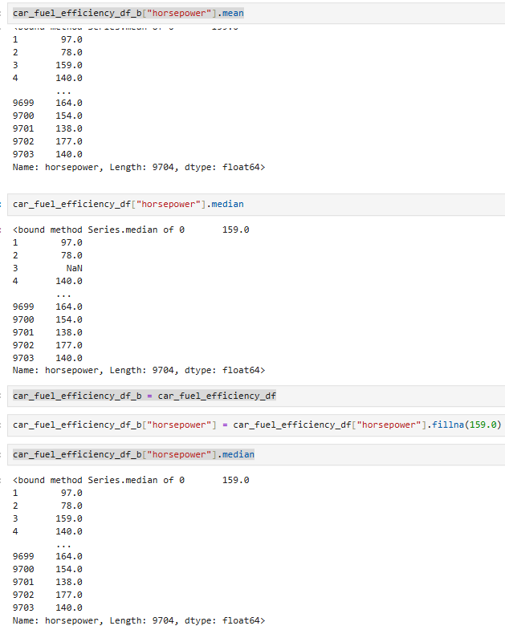
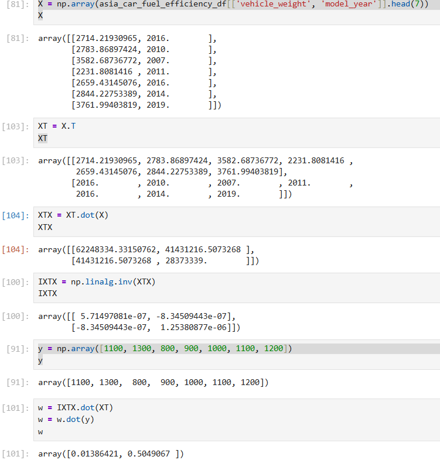

# Machine Learning ZoomCamp - Week 1
Make sure you're in the correct path machine_learning_zoomcamp_2025/week_1/
## Prepare Venv
1. Create the virtual environment
```shell
python -m venv .venv
```
2. Activate it 
 ```shell
    .venv\Scripts\activate
```
3. Create jupyter kernel
```shell
    python -m ipykernel install --user --name week_1 --display-name "Python (week_1)"
```
4. Run jupyter
```shell
 jupyter notebook
```
5. Make sure the venv kernel is selected
    

## Get the data
1. Import pandas
2. Download the [dataset](https://raw.githubusercontent.com/alexeygrigorev/datasets/master/car_fuel_efficiency.csv)
3. Save as CSV into week_1 folder

## Answers
Q1. Pandas version? '2.3.2'
```python
pd.__version__
```


Q2. Records in dataset? 9704
```python
print(car_fuel_efficiency_df.count())
```


Q3. How many fuel types are presented in dataset? 2
```python
car_fuel_efficiency_df.fuel_type.drop_duplicates()
```


Q4. How many columns in dataset have missing values? 4 
```python
car_fuel_efficiency_df.isnull().sum()
```


Q5. Max fuel efficiency of cars from asia? 23.76%
```python
car_fuel_efficiency_df[car_fuel_efficiency_df['origin'] =='Asia'].max()
```


Q6. Median Value of horsepower
It've not changed as the median and average value of horsepower column are the same.


Q7. Linear Regression - 0.51


